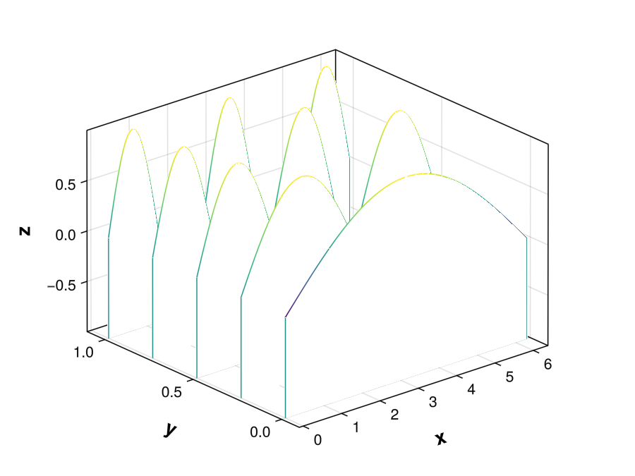

```{julia}
#| echo: false
#| output: false
using StructuralVibration, ShareAdd
@usingany CairoMakie, Meshes
```

`StructuralVibration.jl` is accompanied by a set of three extensions providing visualization capabilities. The extensions provide a set of functions to visualize the results of the structural dynamics analysis. The extensions are:

- `SVMakieExt.jl`: provides plotting functions and requires [Makie.jl](https://docs.makie.org/stable/).
- `SVMeshExt.jl`: provides functions for mesh manipulation and requires [Meshes.jl](https://juliageometry.github.io/Meshes.jl/stable/).
- `SVAnimExt.jl`: provides functions for mesh animation and requires both [Meshes.jl](https://juliageometry.github.io/Meshes.jl/stable/) and [Makie.jl](https://docs.makie.org/stable/).

## Plotting functions

To use the plotting extension, you need to activate the `SVMakieExt.jl` extension by importing the desired plotting package:
```julia
using CairoMakie

# or

using GLMakie
```

### Bode plot

A Bode plot is a graph of the magnitude and phase of a transfer function versus frequency.

::: {.api}
**bode_plot**

---
```{julia}
#| echo: false
@doc bode_plot
```
:::

```{julia}
# Initialize a Sdof type
m = 1.
f0 = 10.
ξ = 0.01
sdof = Sdof(m, f0, ξ)

# Computation parameters
freq = 1.:0.01:30.

# Compute the FRF
prob_frf = SdofFRFProblem(sdof, freq)
H = solve(prob_frf).u

# Bode plot
bode_plot(freq, H)
```

### Nyquist plot

The Nyquist plot is either a 2D or 3D plot. In 2D, it is a graph of the imaginary part versus the real part of the transfer function. In 3D, it is a graph of the imaginary part versus the real part of the transfer function and the frequency.

#### 2D plot

::: {.api}
**nyquist_plot**

---
```{julia}
#| echo: false
@doc nyquist_plot(y::Vector{ComplexF64})
```
:::

```{julia}
nyquist_plot(H)
```

#### 3D plot

::: {.api}
**nyquist_plot**

---
```{julia}
#| echo: false
@doc nyquist_plot(freq, y::Vector{ComplexF64}, ylabel = "Frequency (Hz)"; projection = false)
```
:::

```{julia}
nyquist_plot(freq, H, projection = true)
```

### Waterfall plot

A waterfall plot is a 3D plot with a partial curtain along the y-axis.

::: {.api}
**waterfall_plot**

---
```{julia}
#| echo: false
@doc waterfall_plot
```
:::

```julia
x = range(0., 2π, 100)
y = range(0., 1., 5)

nx = length(x)
ny = length(y)
z = zeros(ny, nx)

for i in eachindex(y)
    z[i, :] = sin.(i*x/2.)
end

waterfall_plot(x, y, z, xlim = [-0.1, 2π + 0.1], ylim = [-0.1, 1.1])
```

{width=85%}

### Stabilization plot

The stabilization plot is used in the context of the modal analysis to plot the [Stabilization diagram](../modal_extraction/index.qmd).

::: {.api}
**stabilization_plot**

---
```{julia}
#| echo: false
@doc stabilization_plot
```
:::

Examples of stabilization plot can be found in the [Modal extraction](../modal_extraction/index.qmd) documentation.

### Peaks plot

The peaks plot is used to visualize the peak detection of a given function. It is a useful tool to define the parameters of the peak detection algorithm use to extract the poles using [Sdof methods](../modal_extraction/index.qmd).

::: {.api}
**peaks_plot**

---
```{julia}
#| echo: false
@doc peaks_plot
```
:::

```{julia}
# Signal used in Peaks.jl package documentation
T = 1/25
t = 0:T:23

y = 3sinpi.(0.1t) + 2sinpi.(0.2t) + sinpi.(0.6t)
peaks_plot(t, y)
```

::: {.callout-note}
`StructuralVibration.jl` uses the `Peaks.jl` package for peak detection. This package includes the functions `plotpeaks` and `peaksplot` for visualizing peaks and their properties, such as prominence and width. These functions require that the peak detection has been performed beforehand.

The `peaks_plot` function in `StructuralVibration.jl` is a simplified version that provides a plotting function which first estimates the peaks and then plots the peaks.
:::

### SV plot

The SV plot (for _StructuralVibration plot_) is a general function for 2D plotting. It is a helper function aiming at simplifying the plotting process.

::: {.api}
**sv_plot**

---
```{julia}
#| echo: false
@doc sv_plot
```
:::

```{julia}
x_sv = range(0., 2π, 100)
z_sv = ntuple(i -> sin.(i*x_sv/2), 5)

# SV plot
sv_plot(x_sv, z_sv..., lw = 2., legend = (active = true,))
```

## Mesh manipulation

To access the mesh manipulation functions, you need to activate the `SVMeshExt.jl` extension by running the following command:
```julia
using Meshes
```

This extension provides functions for mesh manipulation, such as building a mesh from nodes and elements, detrending a plane or a mesh, visualizing a mesh, deforming a grid, and renumbering the element connectivity.

### Building a mesh

The `build_mesh` function allows you to build a mesh from nodes and elements. The function takes as input the nodes and the elements of the mesh and returns a `SimpleMesh` object from Meshes.jl.

::: {.api}
**build_mesh**

---
```{julia}
#| echo: false
@doc build_mesh
```
:::

### Detrending a plane or a mesh

The `detrend_plane` and `detrend_mesh` functions allow you to detrend a plane or a mesh, respectively. The detrending process implemented in `detrend_plane` consists in fitting a plane to the data and substracting the fitted plane from the data. The `detrend_mesh` function first removes the mean from the mesh and then applies the `detrend_plane` function to the each plane.

::: {.api}
**detrend_plane**

---
```{julia}
#| echo: false
@doc detrend_plane
```
:::

::: {.api}
**detrend_mesh**

---
```{julia}
#| echo: false
@doc detrend_mesh
```
:::

### Deforming a grid

The `deformed_grid` function allows you to deform a grid of points by applying a set of values to its nodes. This is useful, for instance, for visualizing the deformation or mode shapes of a structure.

::: {.api}
**deformed_grid**

---
```{julia}
#| echo: false
@doc deformed_grid
```
:::

### Renumbering the element connectivity

The `renumber_element_connectivity` function allows you to renumber the element connectivity of a mesh. This is useful when the element connectivity is not consistent with the node numbering. Indeed, Meshes.jl implicitly states that the nodes in a mesh are numbered from 1 to the number of nodes, and that the element connectivity is defined accordingly. If this is not the case, the `renumber_element_connectivity` function can be used to renumber the element connectivity to be consistent with the node numbering.

::: {.api}
**renumber_element_connectivity**

---
```{julia}
#| echo: false
@doc renumber_element_connectivity
```
:::

## Mesh visualization and animation

To access the mesh manipulation and animation functions, you need to activate the `SVMeshExt.jl` extension by running the following command:
```julia
using Meshes, CairoMakie

# or

using Meshes, GLMakie
```

This extension provides functions for visualizing and animating meshes.

### Visualizing a mesh

The `viz_mesh` function allows you to visualize a static mesh.

::: {.api}
**viz_mesh**

---
```{julia}
#| echo: false
@doc viz_mesh
```
:::

### Animating a mesh

The `animate_mesh` function allows you to animate a mesh by applying a set of values to its nodes. This is useful, for instance, for visualizing the deformation or mode shapes of a structure.

::: {.api}
**animate_mesh**

---
```{julia}
#| echo: false
@doc animate_mesh
```
:::

### Example

In this example, we will visualize the second mode shape of a simply supported plate.

#### Data generation
```{julia}
#| output: false
using LazyGrids

# Dimensions
Lp = 0.6
bp = 0.4
hp = 1e-3

# Material parameters
E = 2.1e11
ρ = 7800.
ν = 0.33

plate = Plate(Lp, bp, hp, E, ρ, ν)
```

#### Mesh creation
```{julia}
# Helper function to create a quadrilateral mesh
function create_quad_mesh(xp::Vector, yp::Vector, nx::Int, ny::Int)
    # Number of quadrangles
    n_quads = (nx - 1) * (ny - 1)
    quads = Vector{Vector{Int}}(undef, n_quads)

    quad_idx = 1
    for j in 1:(ny-1)
        for i in 1:(nx-1)
            # Indices of the nodes of the quadrangle in counter-clockwise order
            n1 = (j-1) * nx + i
            n2 = (j-1) * nx + i + 1
            n3 = j * nx + i + 1
            n4 = j * nx + i

            quads[quad_idx] = [n1, n2, n3, n4]
            quad_idx += 1
        end
    end

    return quads
end

# Create the mesh
nx = 10
ny = 10
x, y = ndgrid(range(0., Lp, nx), range(0., bp, ny))
xp = x[:]
yp = y[:]
zp = zeros(length(xp))

nodes = [xp yp zp]
elts = create_quad_mesh(xp, yp, nx, ny)
mesh = build_mesh(nodes, elts)

fig_mesh = viz_mesh(mesh, zlim = (-0.15, 0.15), title = "Mesh of the plate")
```

#### Visualization of the mode shape
```{julia}
# Compute the second mode shape
ms = sin.(2π*xp/Lp) .* sin.(π*yp/bp)

# Compute deformed grid
ms_deformed = zeros(3size(nodes, 1))
ms_deformed[3:3:end] .= ms

dpoints = deformed_grid(nodes, ms_deformed, 0.15)

fig_deformed = viz_mesh(SimpleMesh(dpoints, mesh.topology.connec), color = ms, zlim = (-0.2, 0.2), title = "Deformed mesh of the plate")
```

#### Animating the mode shape
```julia
animate_mesh(nodes, elts, ms_deformed, color = ms, scale_factor = 0.1, zlim = (-0.2, 0.2), title = "Second mode shape of a simply supported rectangular plate", framerate = 24, filename = "animated_plate.mp4")
```


#### Colormaps

`StructuralVibration.jl` provides the Paraview Fast Colormap as a color gradient that can be used for visualizations. The colormap is implemented in the `fast_cmap` function.

::: {.api}
**fast_cmap**

---
```{julia}
#| echo: false
@doc fast_cmap
```
:::

::: {.callout-warning}
The `fast_cmap` function is a placeholder for the actual implementation of the Paraview Fast Colormap. The implementation of this colormap is not yet available in `ColorSchemes.jl`. A pull request has been submitted and merged in `ColorSchemes.jl`. Once the new version of `ColorSchemes.jl` is released, the `fast_cmap` function will be removed in favor of the `:fast` colormap from `ColorSchemes.jl`.
:::

## Theming

`StructuralVibration.jl` provides a set of themes for the plotting functions. The themes are defined in the `theme_choice` function.

::: {.api}
**theme_choice**

---

```{julia}
#| echo: false
@doc theme_choice
```
:::

```{julia}
with_theme(theme_choice(:makie)) do
    sv_plot(x_sv, z_sv..., lw = 2., legend = (active = true,), title = ":makie theme")
end
```

```{julia}
with_theme(theme_choice(:sv)) do
    sv_plot(x_sv, z_sv..., lw = 2., legend = (active = true,), title = ":sv theme")
end
```