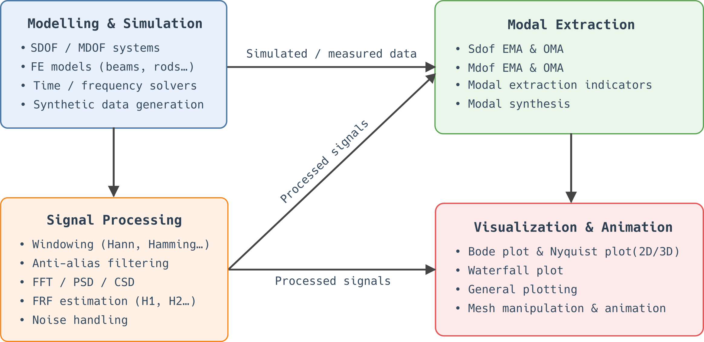
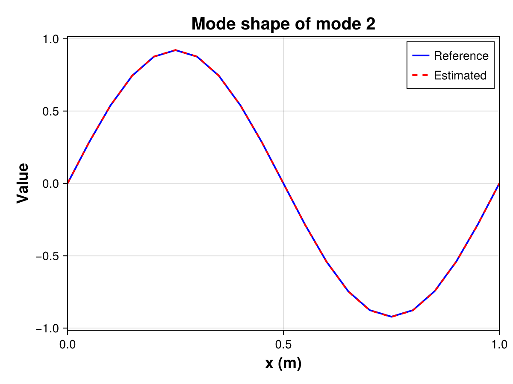

# Summary

`StructuralVibration.jl` is a Julia package designed to generate and analyze vibration data for mechanical systems. It provides tools for modeling, simulating, and analyzing the dynamic behavior of mechanical structures. This package can be used for educational and research purposes. Users can create models of mechanical systems, simulate their response to various inputs, and analyze the resulting vibration data. The package also includes features for visualizing vibration data in 2D and 3D, animating vibration modes and vibration fields, or performing experimental modal analysis. `StructuralVibration.jl` is built on top of the Julia programming language, which offers high performance and ease of use for scientific computing tasks.

# Statement of need

Structural vibration analysis is a crucial aspect of mechanical engineering, as it helps engineers understand the dynamic behavior of structures and predict how they will respond to different inputs. It covers a wide range of applications, including the design of buildings, bridges, vehicles, and machinery. Accurate vibration analysis is essential for ensuring the safety, reliability and optimal performance of these structures.

Analyzing the dynamic behavior requires a combination of theoretical knowledge in both mechanics [@Ger:2015] and signal processing [@Bra:2011], computational tools, and experimental techniques [@Avi:2018]. Mechanical engineers must be able to model the behavior of structures under different loading conditions, simulate their responses to various inputs, and analyze the resulting vibration data. This process can be complex and time-consuming.

Although many tools are available for structural vibration analysis, most are written in languages such as Matlab or Python. For example, the Python ecosystem for structural vibration analysis is fragmented [@Sla:2025], with various libraries and tools available for different aspects of the analysis. These include `pyOMA2`, `pyFBS`, `OpenSeesPy` or `SDynPy`. This can make it difficult for engineers to find the right tools for their specific needs and to integrate them into a cohesive workflow.

To the best of our knowledge, there is currently no package dedicated to structural vibration analysis available in the Julia programming language. `StructuralVibration.jl` aims to fill this gap by providing an accessible, package for generating and analyzing vibration data in Julia. It is designed to be user-friendly for beginners and experienced engineers alike, it is a valuable resource for education and research in the field of structural dynamics.

`StructuralVibration.jl` has already been used for educational purposes in a structural dynamics course at the Conservatoire National des Arts et Métiers (Cnam) in Paris, France. It has also been used for research purposes in the context of force reconstruction from vibration data [@Auc:2025]. The package is open-source under an MIT license and available on GitHub, allowing for community contributions and future development.

# Package design

`StructuralVibration.jl` is designed according to certain guidelines to ensure that it is user-friendly, efficient, extensible, and composable. These guidelines include:

- *Type stability*: All of the package's functions are designed to ensure type stability, allowing for efficient execution and better performance.

- *Type genericity*: The package is designed to be type-generic, enabling users to work with various data types, such as `Float64`, `ComplexF32`, while maintaining performance and flexibility.

- *Composability*: The package is design to be compatible with other Julia packages. For example, users can define a state-space model using `StructuralVibration.jl` and perform the resolution using another package such as `DifferentialEquations.jl`.

- *Reliability*: `StructuralVibration.jl` includes a comprehensive documentation and a test suite that ensures the reliability and correctness of the package. The documentation provides detailed explanations of the theoretical background of the package's features, as well as the API of the data types and functions implemented. Various examples are also provided to help users get started.

- *Modularity*: The package is based on a modular architecture that clearly separates the different functionalities (Modelling & Simulation, Signal Processing, Modal Extraction, Visualization & Animation) and facilitates the maintenance and extension. The general architecture of the package is presented in \autoref{fig:architecture}.



# Example

The example presented below demonstrates how to use `StructuralVibration.jl` to create a simple model of a simply supported beam, simulate its transfer function matrix, extract its first four vibration modes using the Least-Squares Complex Frequency-domain (LSCF) method, and visualize the mode shapes (see \autoref{fig:visu_example}).

## Creation of the beam model
```julia
using StructuralVibration

# Geometric and material properties
L = 1.        # Length
b = 0.03      # Width
h = 0.01      # Thickness
S = b*h       # Cross-section area
Iz = b*h^3/12 # Moment of inertia

E = 2.1e11  # Young's modulus
ρ = 7850.   # Density
ξ = 0.01    # Damping ratio

# Create the beam model
beam = Beam(L, S, Iz, E, ρ)
```

## Simulation of the transfer function matrix
```julia
# Mesh definition
xexc = 0:0.05:L
xm = xexc[2]

# Vibration modes calculation
fmax = 500.
ωn, kn = modefreq(beam, 2fmax)
ms_exc = modeshape(beam, kn, xexc)
ms_m = modeshape(beam, kn, xm)

# FRF calculation
freq = 1.:0.1:fmax
prob = ModalFRFProblem(ωn, ξ, freq, ms_m, ms_exc)
H = solve(prob).u
```

## Mode extraction
```julia
# EMA problem
prob_mdof = EMAProblem(H, freq)

# Stabilization diagram analysis using the LSCF method
order = 10
stab = stabilization(prob_mdof, order, LSCF())
stabilization_plot(stab)

# Compute the resonance frequencies and damping ratios from the poles
p_lscf = poles_extraction(prob_mdof, order, LSCF())
fn, ξn = poles2modal(p_lscf)

# Mode shapes extraction
dpi = [1, 2]
res = mode_residues(prob_mdof, p_lscf)
ms_est = modeshape_extraction(res, p_lscf, LSCF(), dpi = dpi, modetype = :emar)[1]
ms_est_real = real_normalization(ms_est)
```

## Visualization of the mode shapes
```julia
using CairoMakie

set_theme!(theme_choice(:sv))

# Mode shapes visualization
id_mode = 2
sv_plot(
  xexc, ms_exc[:, id_mode], ms_est_real[:, id_mode],
  title = "Mode shape of mode $id_mode", lw = 2., xlabel = "x (m)", ylabel = "Value",
  legend = (active = true, position = :rt, entry = ("Reference", "Estimated"))
)
```

{width=65%}

# References

